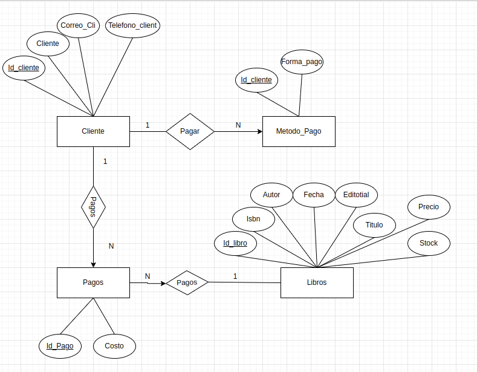

## Danny Julian Velasco OLARTE

### Formas Normales


#### Forma Normal 1

```
Vamos a primera forma normal reduciendo la redundancia ya que la tabla ya tiene datos atomicos
```


#### Forma Normal 2
```
En segunda forma normal lo primero es estar en primera forma normal y proceder a eliminar columnas no dependientes de nuestra prymary key
```


#### Forma Normal 3
```
En Tercera forma normal lo primero es estar en segunda forma normal y proceder a eliminar Las dependencias transitivas
```


#### Diagrama 1
```
creacion de diagrama numero 1
```


#### Diagrama 2
